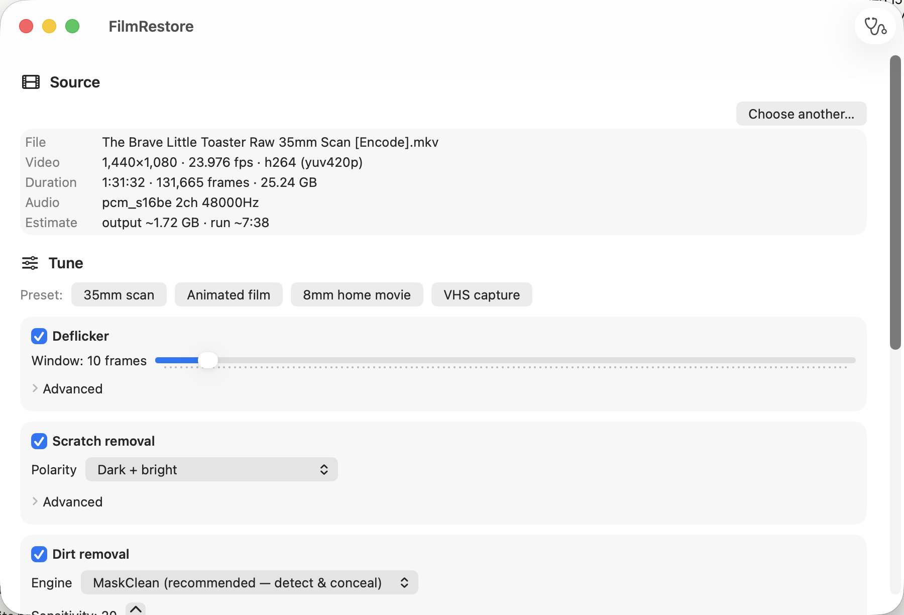
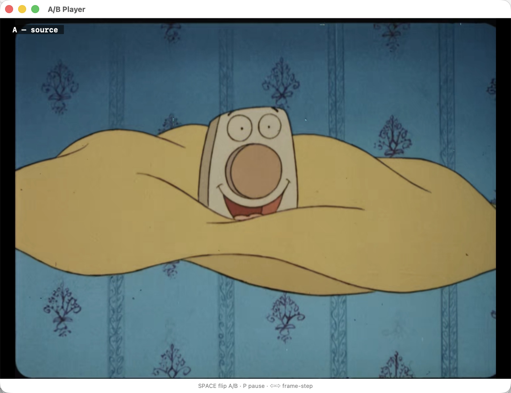
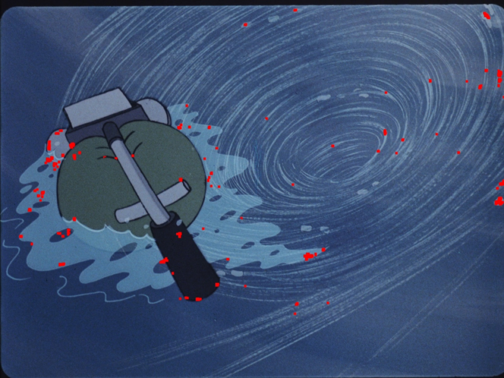
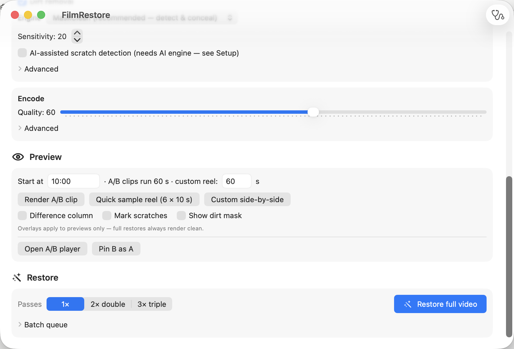

# FilmRestore

**One-window film restoration for the Mac.** Drop in a digitized film scan, preview the
cleanup on real footage, and render a restored copy — deflicker, scratch removal, and
dirt removal in a single lossless-quality encode. Native SwiftUI on Apple Silicon,
driving Homebrew-installed ffmpeg and VapourSynth. All FOSS, GPL-3.0.



## What it does

Fixed, validated processing order: **deflicker → scratch removal → dirt removal →
encode**, all inside one VapourSynth graph and one hardware HEVC encode — no
intermediate files, no generational loss, even with 2×/3× multi-pass processing.

| Stage | Engine | Notes |
|---|---|---|
| Deflicker | Bit-exact port of ffmpeg's `vf_deflicker` | Validated 1438/1440 frames identical to ffmpeg; power-mean default |
| Scratch removal | DeScratch 4.0 (built from source) | Polarity control — *bright-only mode cannot touch dark ink lines* (animation-safe) |
| Dirt removal | **MaskClean** (built for this app) | Detect → reviewable mask → conceal; pixels outside the mask pass through **bit-exact** |
| | RemoveDirt MC / classic, SpotLess | Alternative engines, selectable |
| AI tier (optional) | Microsoft BOPBTL scratch U-Net on the GPU | Spatial masks for persistent gouges that temporal detection can't see; MIT weights, ~2.5 GB install |

**MaskClean** is the app's own implementation of the architecture professional tools
(DVO Dust, MTI Shine, Resolve ADR) use: motion-compensated temporal-spike detection,
safety classifiers (blob size/shape gating, adjacent-frame suppression, scene-cut
zeroing, a sparkle-inversion guard for stochastic animated texture), then repair
*only inside the mask*. Measured on a real 35mm scan with a synthetic-defect harness:
**precision 0.98 / recall 0.95** on static footage at a 0.002% false-positive pixel
rate.

## See before you commit

Every tuning decision is preview-driven:

**A/B player** — render a 60-second test clip and flip source↔restored instantly with
the spacebar; frame-step both sides in lock-step. Opens as its own window so settings
stay editable.



**Detection mask preview** — see exactly what the cleaner will touch before it touches
it (red = dirt detections, yellow = AI scratch regions). No more guessing at
thresholds.



**Side-by-side reels** — source | restored | difference, stitched from six random
10-second samples across the whole film (or any custom range). The difference column
shows every changed pixel: black = untouched.


**Workflow-shaped UI** — Source → Tune → Preview → Restore, simple by default with
per-filter Advanced disclosures. Settings persist globally *and* per film (a sidecar
file next to each scan remembers its tuning session).



## Presets

**35mm scan** · **Animated film** (bright-only scratches so ink outlines are immune,
AI dark-line shield) · **8mm home movie** · **VHS capture** — one click each, every
parameter still adjustable.

## Measured performance (M4 Pro, 1440×1080 scan)

| | |
|---|---|
| Full restoration chain | ~250 fps ≈ 10× realtime — a 90-minute film in ~9 minutes |
| Output size (quality 60) | ~1.7 GB per movie |
| AI scratch analysis | ~1–2 fps (optional pass; use on test clips first) |
| Deflicker fidelity | bit-identical to ffmpeg on 1438/1440 validation frames |

## Install

1. **Homebrew tools**
   ```
   brew install ffmpeg                                            # required
   brew install vapoursynth vapoursynth-bestsource meson ninja fftw pkgconf   # restoration stack
   ```
2. **The app** — open [release/FilmRestore.dmg](release/FilmRestore.dmg) (kept current
   in this repo; right-click → Open on first launch, it's unsigned), or build it:
   `cd FilmRestore && ./scripts/make-dmg.sh`
3. **Restoration plugins** — Setup (stethoscope icon) → *Download plugins…* installs
   four sha256-pinned prebuilts and builds MVTools + DeScratch from source into
   `~/Library/Application Support/FilmRestore/` (Homebrew's tree is never touched).
   *Run smoke test* proves the whole stack, including a canary that catches
   silently-broken plugin/VapourSynth pairings.
4. **Optional AI engine** — one click, ~2.5 GB (PyTorch + scratch-detection weights,
   checksummed).

## Safety rails

Sources are opened read-only and outputs are auto-suffixed copies — the app never
overwrites anything. Disk-space guard before every job with quality-aware estimates.
Sleep prevention during renders. Per-job logs, and every error dialog has a **Copy
debug info** button that captures the error, all settings, and the log tail for
paste-ready troubleshooting.

## Project docs

- [docs/ADR.md](docs/ADR.md) — 14 architecture decision records
- [docs/PLAN.md](docs/PLAN.md) — milestone history with verification criteria
- [spikes/RESULTS.md](spikes/RESULTS.md) — every validation spike and measurement
- [docs/research/](docs/research/) — the four-angle restoration-technique research
  behind the MaskClean/AI design
- [CLAUDE.md](CLAUDE.md) / [STATE.md](STATE.md) — repo-based process management

## Development

```
cd FilmRestore
swift build && .build/debug/FilmRestore     # run from source
swift test                                  # unit tests
.build/debug/FilmRestore --selftest <file>      # headless end-to-end verification
.build/debug/FilmRestore --selftest-vs <file>   # VapourSynth-chain verification
.build/debug/FilmRestore --doctor               # dependency + plugin health
```

License: **GPL-3.0** (DeScratch and RemoveDirt are GPL; see ADR-11). The bundled
scratch-detection model is MIT (Microsoft "Bringing Old Photos Back to Life").
